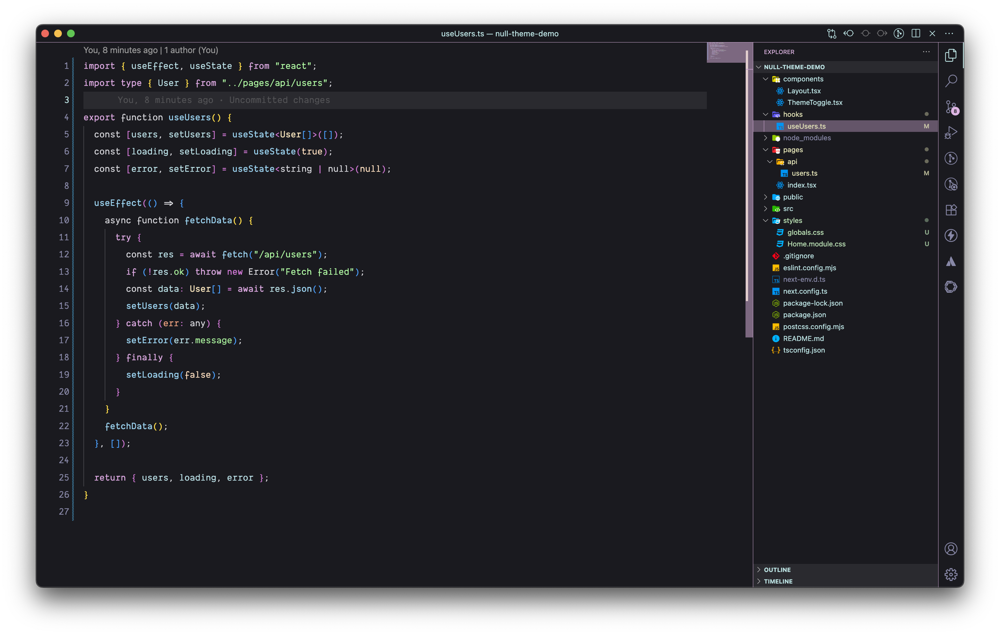
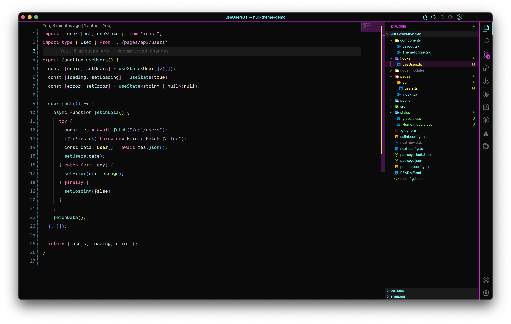
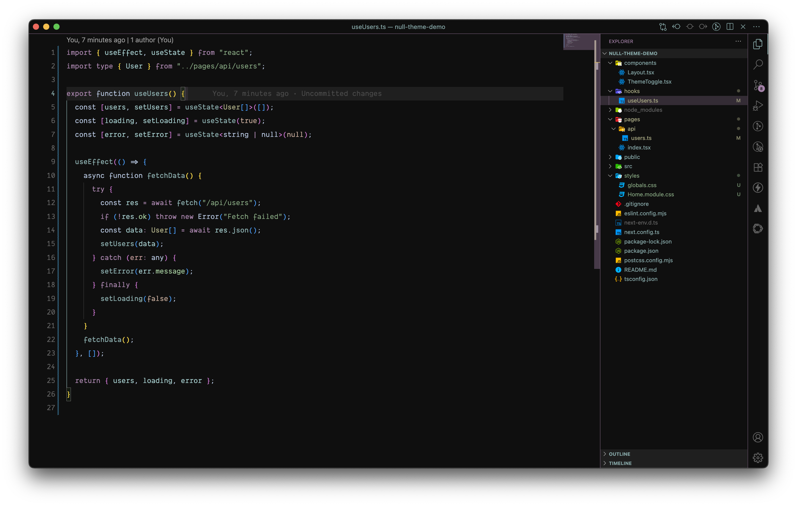
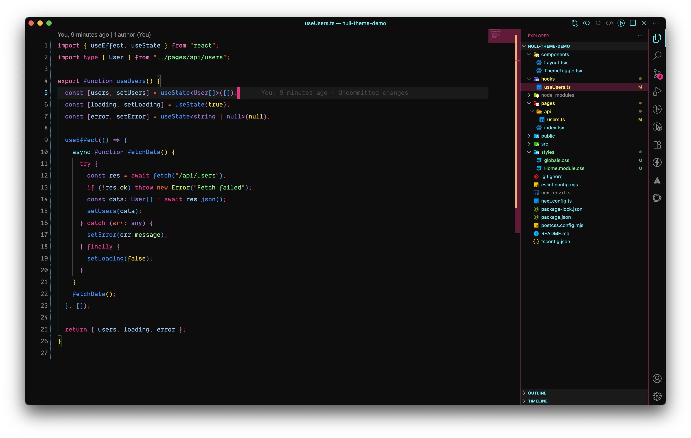
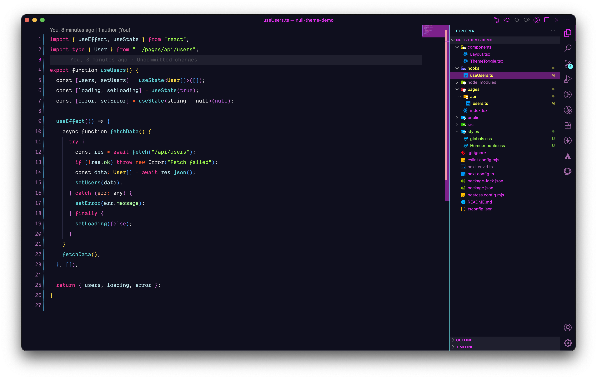
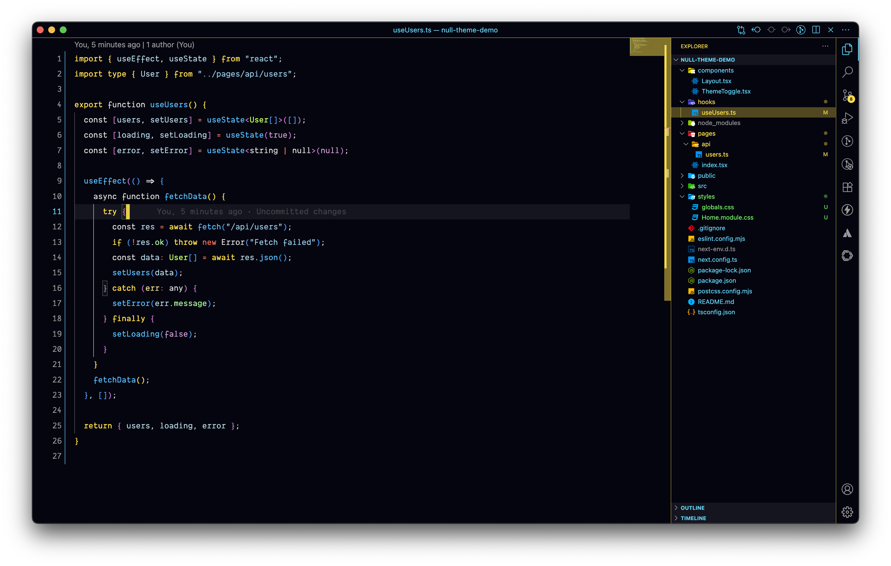
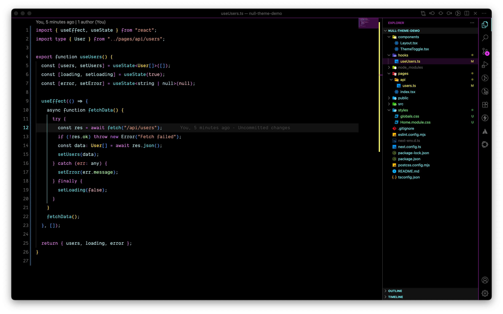
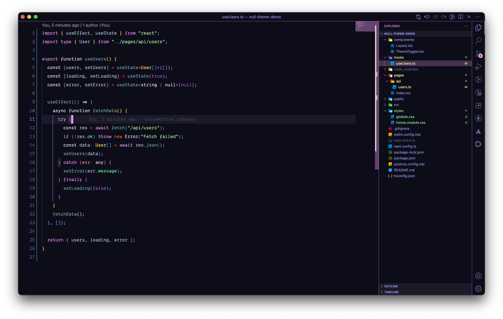

<p align="center">
  
</p>

<h1 align="center">🧱 Null Theme Collection</h1>

<p align="center">
  <strong>Cyberpunk-inspired VS Code themes with enhanced contrast and frameless minimal chrome.</strong>
</p>

<p align="center">
  
  
  
</p>

---

## ✨ Features

- 🔍 **Enhanced Contrast** – Syntax elements with clear, bold color separation
- 🎯 **Clear Token Differentiation** – Easy to distinguish variables, functions, and types
- 🌈 **Rich Neon Palette** – Cyberpunk vibes, vivid pastels, and soft contrasts
- 🖥 **OLED-Friendly** – Especially with the Absolute Black variant
- 🌐 **Multi-Language Support** – JavaScript, TypeScript, Python, HTML, CSS, JSON, Markdown, and more
- 🖼 **Frameless Design** – Minimal borders and chrome for a distraction-free workspace

---

## 🔧 Customization

Each theme can be further customized by modifying the JSON files:

```json
{
  "colors": {
    "editor.background": "#000000",
    "editor.foreground": "#B0E0E6"
  },
  "tokenColors": [
    {
      "name": "String",
      "scope": ["string"],
      "settings": {
        "foreground": "#E9967A"
      }
    }
  ]
}
```

## 🍰 Pastel



## 🌑 Near Black



## 🌫️ Muted



## 🌈 Vivid



## 🕹 Synthwave



## ⚡ Electric



## ⬛ Absolute Black



## 🌌 Midnight



### Absolute Black

- Pure black background with maximum contrast
- Perfect for OLED displays

### Electric

- Electric blue and yellow combination
- High-energy coding experience

### Synthwave

- Neon lights of the 80s
- Inspired by retro-futurism

### Pastel

- Soothing colors
- Perfect for low-light environments

## 🧪 Installation

From VSCode:

1. Open Extensions sidebar (`Ctrl+Shift+X`)
2. Search for **"Null Theme"**
3. Click **Install** on your preferred variant

Or install via CLI:

```bash
code --install-extension kimberlycasamina.null-theme
```

📁 Repository
GitHub: kimicasamina/vscode-null-theme

VSCode Marketplace: Null Theme Collection

🔖 License
MIT License © 2025 Kimberly Casamina
